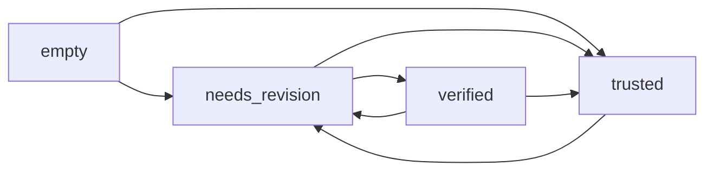

# PRD: Campo "Confidence" en Resources

## Introducción/Overview

Este PRD define la implementación de un nuevo campo "Confidence" en la colección `Resources` de PayloadCMS. El campo proporcionará una evaluación automática de la calidad y confiabilidad de los datos procesados por Azure Document Intelligence, categorizando los recursos según el estado de sus campos analizados y las intervenciones humanas realizadas.

**Problema que resuelve:** Actualmente no existe una forma visual y sistemática de identificar qué recursos tienen datos confiables, cuáles necesitan revisión humana, o cuáles ya han sido verificados manualmente. Esto dificulta la priorización del trabajo de revisión y la confianza en los datos extraídos.

**Objetivo:** Crear un sistema automatizado de clasificación de confianza que permita a los usuarios identificar rápidamente el estado de calidad de cada recurso y tomar decisiones informadas sobre qué documentos priorizar para revisión.

## Goals

1. **Clasificación automática:** Implementar un sistema que evalúe automáticamente la confianza de los recursos basándose en los valores de confidence de sus campos.
2. **Visibilidad:** Mostrar el estado de confianza de forma clara en todas las tablas de recursos del sistema.
3. **Configurabilidad:** Permitir ajustar el umbral de confianza desde la configuración global del sistema.
4. **Trazabilidad:** Garantizar que las transiciones de estado reflejen accuradamente los cambios en los datos y las intervenciones manuales.
5. **Compatibilidad:** Aplicar el nuevo sistema a todos los recursos existentes sin perder datos.

## User Stories

**Como administrador del sistema:**
- Quiero ver rápidamente qué documentos necesitan revisión para priorizar el trabajo del equipo.
- Quiero poder ajustar el umbral de confianza según las necesidades de calidad del proyecto.
- Quiero que el sistema se actualice automáticamente cuando se procesan documentos o se hacen correcciones manuales.

**Como usuario revisor:**
- Quiero identificar fácilmente qué documentos tienen campos con baja confianza para enfocar mi trabajo de revisión.
- Quiero que el sistema reconozca automáticamente cuando he corregido todos los campos problemáticos.
- Quiero ver visualmente el progreso de verificación de los documentos.

**Como usuario consultor:**
- Quiero saber qué documentos son completamente confiables para mis análisis y reportes.
- Quiero distinguir entre datos automáticos de alta confianza y datos verificados manualmente.

## Functional Requirements

### 1. Campo Confidence en Resources
- **R1.1:** Añadir campo `confidence` de tipo `select` con las opciones:
  - `empty` (1): "Vacío o no aplica" - Estado inicial o cuando no hay datos suficientes
  - `needs_revision` (2): "Necesita revisión" - Campos con confidence < umbral
  - `trusted` (3): "Confiable" - Todos los campos ≥ umbral
  - `verified` (4): "Verificado" - Revisado y corregido manualmente

### 2. Configuración del Umbral
- **R2.1:** Añadir campo `confidenceThreshold` en la colección global `Configuracion`.
- **R2.2:** Valor por defecto: 70 (equivalente a 0.70 en decimal).
- **R2.3:** Campo tipo `number` con validación (0-100).
- **R2.4:** Ubicación: pestaña "Analítica" de la configuración global.

### 3. Lógica de Cálculo Automático
- **R3.1:** Función `calculateResourceConfidence(resource, threshold)` que evalúe:
  - Si no existe `analyzeResult.fields` → `empty`
  - Si algún campo no manual tiene `confidence < (threshold/100)` → `needs_revision`
  - Si todos los campos no manuales tienen `confidence ≥ (threshold/100)` → `trusted`
  - Si todos los campos con confidence < threshold tienen `manual: true` → `verified`

### 4. Actualización Automática
- **R4.1:** Ejecutar cálculo automático cuando:
  - Se recibe un webhook de Azure con `analyzeResult`
  - Se modifica manualmente un campo (marcándolo como `manual: true`)
  - Se reprocesa un documento

### 5. Server Action
- **R5.1:** Crear `updateResourceConfidence(resourceId)` en `src/actions/resources/`
- **R5.2:** Incluir validaciones de acceso y manejo de errores
- **R5.3:** Retornar el nuevo estado calculado

### 6. Hooks de Actualización
- **R6.1:** Integrar la actualización automática en el webhook existente de Resources
- **R6.2:** Añadir hook `afterChange` en la colección Resources para detectar cambios en `analyzeResult`

### 7. Migración de Datos Existentes
- **R7.1:** Crear función de migración `migrateExistingResourcesConfidence()`
- **R7.2:** Aplicar cálculo a todos los recursos existentes
- **R7.3:** Ejecutar automáticamente al hacer deploy

### 8. Visualización en Admin
- **R8.1:** Añadir `confidence` a `defaultColumns` en la configuración admin de Resources
- **R8.2:** Implementar componente visual con colores distintivos:
  - `empty`: Gris claro
  - `needs_revision`: Amarillo/Naranja
  - `trusted`: Verde
  - `verified`: Azul/Verde oscuro

### 9. Visualización en Frontend
- **R9.1:** Añadir campo confidence a todas las tablas de recursos:
  - VideoTable en proyectos
  - Tablas de recursos en cliente
  - Cualquier lista de recursos existente
- **R9.2:** Implementar badges/indicadores visuales consistentes
- **R9.3:** Hacer el campo filtrable y ordenable donde aplique

## Non-Goals (Out of Scope)

- **NG1:** No se implementará notificaciones push o email sobre cambios de estado
- **NG2:** No se creará histórico de cambios de confidence (se mantiene solo el estado actual)
- **NG3:** No se implementará confidence a nivel de campo individual en el UI (solo a nivel de documento)
- **NG4:** No se modificará la lógica de procesamiento de Azure Document Intelligence
- **NG5:** No se implementará validaciones manuales de que un usuario realmente revisó el documento

## Design Considerations

### Componente Visual
- Usar `Badge` de Shadcn con colores distintivos
- Iconos de tabler: `IconCircle`, `IconAlertTriangle`, `IconShieldCheck`, `IconShieldCheckFilled`
- Tooltip explicativo del estado en hover

### Estados y Transiciones


### Estructura de Datos
```typescript
// En Configuracion global
confidenceThreshold: number // 70 por defecto

// En Resources
confidence: 'empty' | 'needs_revision' | 'trusted' | 'verified'

// En analyzeResult.fields
{
  "fieldName": {
    "confidence": 0.85, // 0-1
    "manual": true, // opcional
    // ... otros campos
  }
}
```

## Technical Considerations

### Dependencias
- Usar tipos existentes de `payload-types.ts`
- Integrar con el sistema de webhooks actual
- Aprovechar la infraestructura de server actions existente

### Performance
- La función de cálculo debe ser eficiente para ejecutarse en cada webhook
- Cachear el umbral de configuración para evitar consultas repetidas
- Considerar índice en el campo confidence para filtros rápidos

### Validaciones
- Validar que el threshold esté entre 0-100
- Manejar casos donde `analyzeResult` no exista o esté malformado
- Verificar acceso del usuario para modificar recursos

### Integración con Sistema Actual
- Preservar lógica existente de preservación de campos manuales
- No interferir con el flujo actual de procesamiento
- Mantener compatibilidad con el componente `AnalyzeFieldsEditor`

## Success Metrics

### Métricas de Adopción
- **M1:** 100% de recursos existentes migrados correctamente
- **M2:** 0% de errores en el cálculo automático durante las primeras 48 horas
- **M3:** Visualización correcta en todas las tablas donde aparecen recursos

### Métricas de Funcionalidad
- **M4:** Tiempo de respuesta < 200ms para calcular confidence de un recurso
- **M5:** Precisión del 100% en la detección de campos manuales vs automáticos
- **M6:** Transiciones de estado coherentes en el 100% de los casos

### Métricas de UX
- **M7:** Reducción del tiempo de identificación de documentos a revisar
- **M8:** Feedback positivo de usuarios sobre la claridad del sistema de estados

## Open Questions

### Preguntas Técnicas
- **Q1:** ¿Debería haber un índice de base de datos en el campo confidence para optimizar filtros?
- **Q2:** ¿Es necesario registrar en logs cuando cambia el estado de confidence?

### Preguntas de Producto
- **Q3:** ¿Debería existir un dashboard o reporte que muestre estadísticas de confidence a nivel de proyecto?
- **Q4:** ¿Queremos mantener un contador de cuántos campos fueron corregidos manualmente?

### Preguntas de Implementación
- **Q5:** ¿Debería ejecutarse la migración automáticamente en deploy o como comando separado?
- **Q6:** ¿Es necesario un sistema de rollback si hay problemas con el cálculo inicial?

## Tasks de Implementación Sugeridas

### Fase 1: Backend Core
1. Añadir campo confidence a Resources.ts
2. Añadir confidenceThreshold a Configuracion.ts
3. Implementar función calculateResourceConfidence
4. Crear server action updateResourceConfidence

### Fase 2: Integración
5. Integrar actualización automática en webhook de Resources
6. Añadir hook afterChange a Resources
7. Implementar migración de datos existentes

### Fase 3: Frontend
8. Añadir visualización en admin de PayloadCMS
9. Crear componente Badge para confidence
10. Actualizar todas las tablas de recursos en frontend

### Fase 4: Testing y Deploy
11. Testing de todos los flujos de actualización
12. Validación de la migración en ambiente de staging
13. Deploy con monitoreo de errores

---

**Documento creado:** {fecha}  
**Versión:** 1.0  
**Estado:** En revisión
